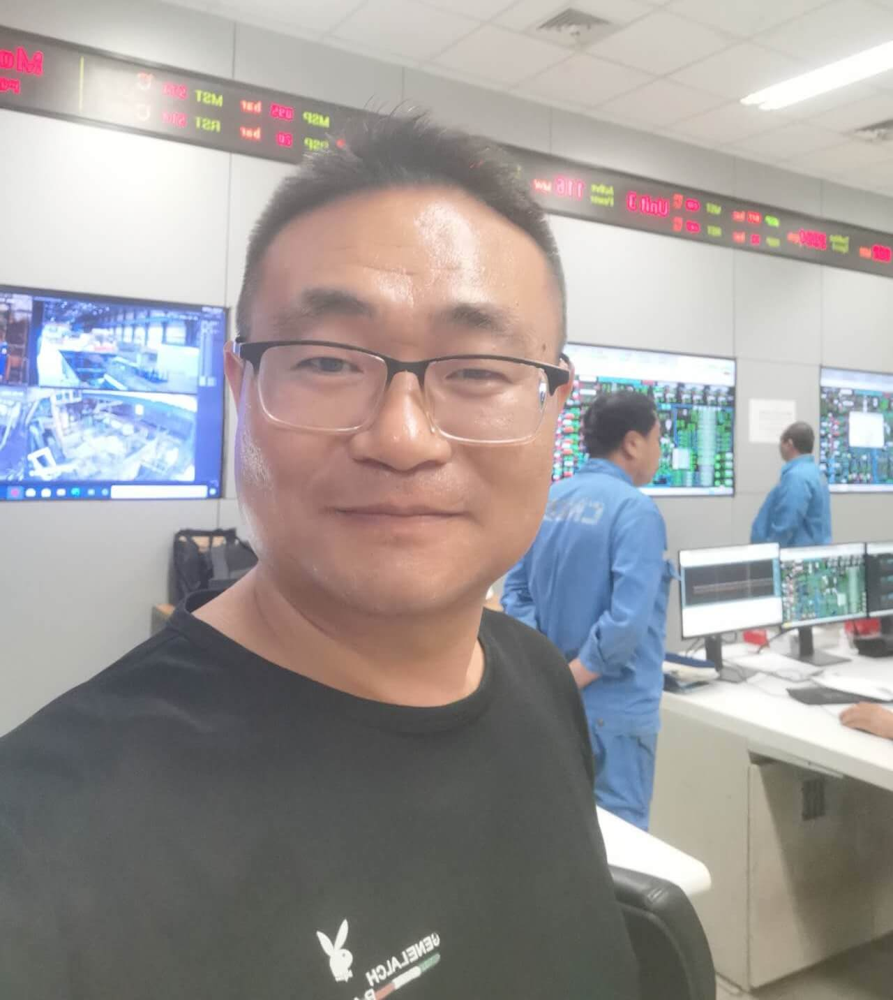

My name is Yuguang Guo, a CN-EN translator and interpreter. I have translation and interpreting experience in following industries: 

## Translation Experience
- 2 years in a coal-fired thermal power plant of [Botswana Power Corporation](https://www.bpc.bw/), seasoned in translating things related to mechanical, electrical, welding, NDT/NDE, chemical, civil construction, instrumentation and control, commissioning, and various tests (such as RB test, BTG), etc. 

- 5 years working in substations of [EDTL](https://edtl-ep.tl/home/en/), seasoned in translating things related to protective relay, safety operation, and local employee training. 
- I can also speak English, Tetun, and a little Portuguese.

Ever since 2017, I started to learn something related to web creation and marketing. 

## E-commerce Experience
I have experience working in industry of **e-commerce**.
- I used to work in cross-border e-commerce industry with creating and running several e-commerce websites, covering Shopify (like fanwer.com but the performance is bad due to decentralized topic) and WooCommerce (depending on WordPress environment).
- Perform digital marketing, such as SEO, SEM, affiliate marketing, email marketing, influencer marketing, and social media marketing.

In an era of AI, I decide to learn something new to me - programming. Start from Python.

## Programming & Coding
- I am still in the process of learning Python and related modules (Numpy, Matplotlib, Pandas, MySQL) or frames (Pytorch).
- Markdown programming language which this little blog was built on.

What else do you wanna know about me?
